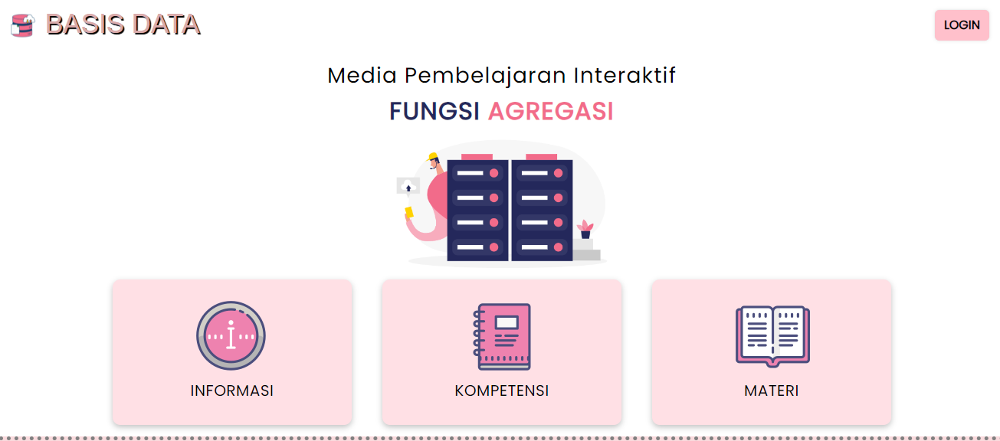
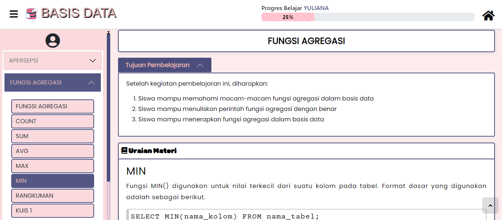
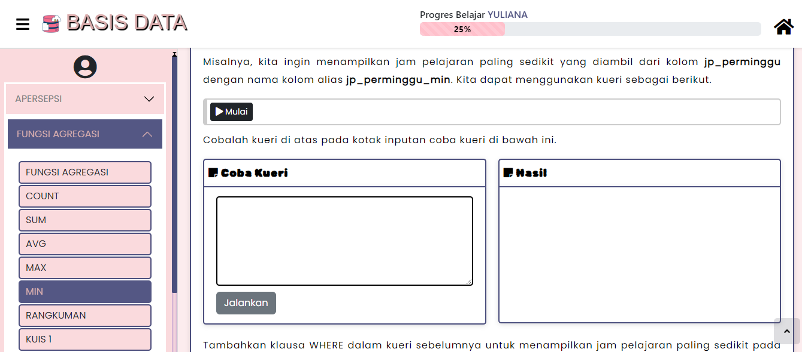
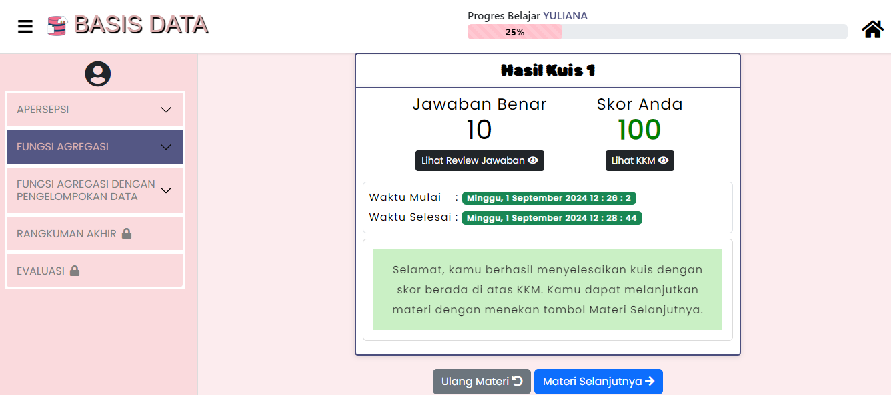

# Tugas 1 Pembelajaran Berbantuan Komputer
Oleh : Yuliana (2110131220001)

[Klik untuk mengakses Media Pembelajaran](https://fungsi-agregasi-basis-data.netlify.app/)

# Review Media Pembelajaran Interaktif Fungsi Agregasi

Berdasarkan hasil analisis yang saya lakukan, Media pembelajaran ini berisi materi Fungsi Agregasi Mata Pelajaran Basis Data untuk siswa SMK kelas XI RPL. Dalam media ini terdapat penyajian materi, kegiatan praktik, dan latihan soal berupa pertanyaan dan kuis yang dikemas secara interaktif dan menarik. Media ini dibuat oleh Haniah Zahratunnisa yang merupakan mahasiswa pendidikan komputer pada tahun 2023.

## - As Tutor

Terdapat materi fungsi agregasi yang dijelaskan secara terstruktur(berurutan) yang disertakan dengan animasi bergerak untuk menjelaskan langkah dalam mengetikkan kode. Penyampaian materi menggunakan metode tutorial, tentunya media ini dapat dikatakan termasuk Computer as tutor karena dapat membimbing siswa untuk memahami materi yang disajikan.

## - As Tool

Media ini memiliki tampilan khusus yang memungkinkan pengguna melakukan uji coba langsung untuk mengetikkan kode yang sudah dipelajari, pada kolom "Coba Kueri" untuk kodenya dan klik tombol jawaban maka hasilnya akan tampil pada kolom "Hasil". Dalam hal ini maka Media ini dapat dikatakan termasuk Computer as tool karena dapat menjadi alat bantu pengguna menjalan kode kueri.

## - As Tute

Media pembelajaran ini dibuat dengan dua pengguna, yaitu siswa dan guru sehingga didalamnya terdapat beberapa settingan yang dimasukkan guru untuk mengatur kriteria pemahaman siswa melalui media ini. Untuk siswa yang mengakses materi harus tuntas diakses agar dapat lanjut pada materi selanjutnya dengan menyelesaikan kuis, jika tidak maka computer akan mengajarkan ulang pada siswa mengenai materi tersebut sampai nilai siswa memenuhi standar KKM yang diatur oleh guru. Dalam hal ini maka media ini dapat dikatakan termasuk Computer as tute karena memuat kondisi bahwa pengguna dapat belajar secara mandiri melalui komputer yang sudah diberikan arahan(setting) oleh guru, guru juga dapat memantau perkembangan pemahaman dan progres siswa melalui halaman guru.

## Hasil Review

Hasil review saya pribadi mengatakan bahwa media pembelajaran interaktif Fungsi Agregasi bisa dikatakan sebagai Computer As Tutor, Tool and Tute. Rate dari yuliana untuk media ini adalah 5 :)

[Total 305 Kata] Banjarmasin |
Minggu, 01 September 2024