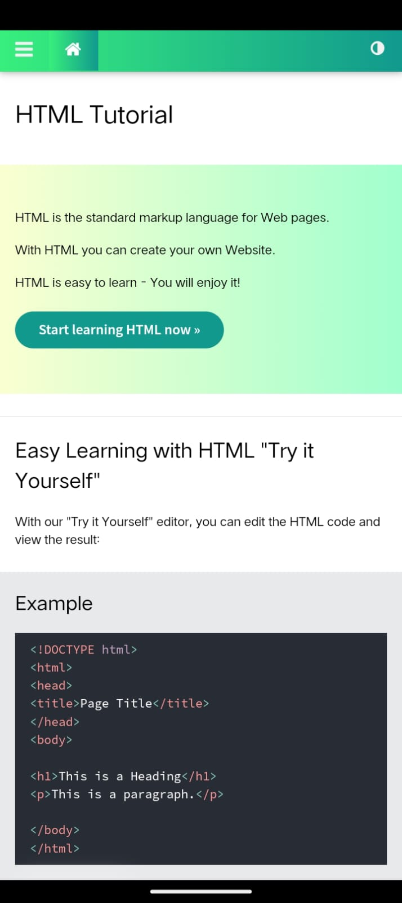
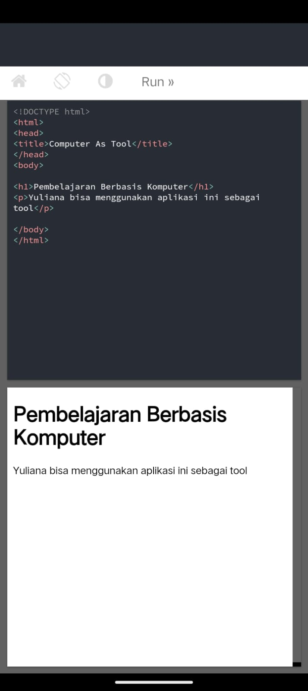
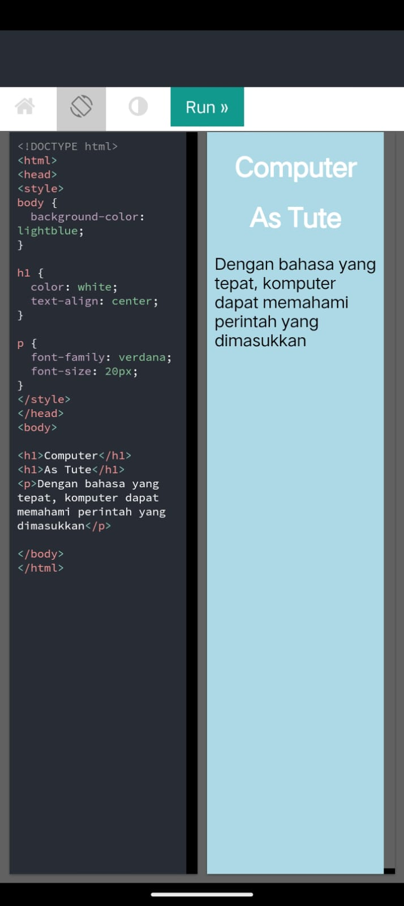
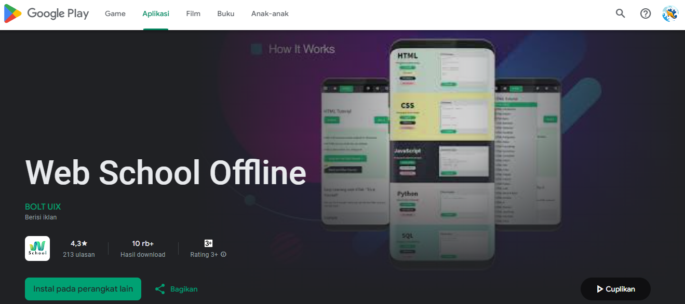
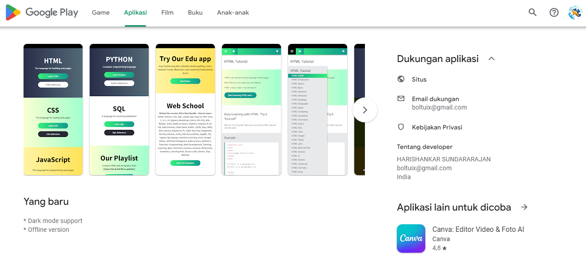

# Tugas 1 Pembelajaran Berbantuan Komputer
Oleh : Yuliana (2110131220001)

[Klik untuk mengunduh Web School Offline](https://play.google.com/store/apps/details?id=com.boltuix.webschool&pcampaignid=web_share)

# Review Aplikasi Web School Offline

Web School Offline adalah aplikasi mobile untuk belajar bahasa pemrograman seperti HTML, PYTHON, CSS, SQL, Javascript dan lain sebagainya. Aplikasi ini dibuat oleh BOLT UIX yang merupakan spesialis mobile app developer. Mendapatkan rating 4,3 di Google Playstore, bisa dikatakan bahwa aplikasi ini merupakan versi mobile dari situs _"w3school.com"_ yang bisa diakses secara offline melalui smartphone.

## - As Tutor

Melalui tutorial atau langkah-langkah yang disediakan pada halaman tutorial, aplikasi Web School Offline dapat membantu menyampaikan materi pelajaran dengan lebih efisien, dimana tertera jelas langkah mengenai apa yang diperlukan beserta dengan penjelasan dari langkah-langkah yang dikerjakan. Dalam hal ini maka Web School Offline dapat dikatakan termasuk Computer as tutor karena dapat membimbing pengguna untuk memahami materi yang disajikan.

## - As Tool

Aplikasi Web School Offline menyediakan konten pembelajaran tentang bahasa pemrograman dan dapat digunakan sebagai tool dalam belajar bahasa pemrogramannya. Pengguna dapat melakukan uji coba langsung pada aplikasi melalui kotak yang tersedia dan dapat melakukan running sehingga hasilnya akan langsung muncul. Dalam hal ini maka Web School Offline dapat dikatakan termasuk Computer as tool karena dapat menjadi alat bantu pengguna menjalan kode.

## - As Tute

Untuk aplikasi Web School Offline, saya merasa computer masih belum bisa diajari seperti anak didik, namun dapat memahami perintah yang dimasukkan oleh pengguna selama kode atau perintah yang dimasukkan sesuai dengan bahasa pemrograman yang digunakan. Tidak terdapat soal latihan namun pengguna dapat bereksperimen sendiri dengan menggunakan fitur _"Try it Yourself"_. Dalam hal ini maka Web School Offline mungkin bisa dikatakan termasuk Computer as tute karena memuat kondisi bahwa pengguna dapat membuat program melalui tool yang tersedia dan akan merespon jika pengguna salah memasukkan kode.

## Hasil Review

Hasil review saya pribadi mengatakan bahwa aplikasi Web School Offline bisa dikatakan sebagai Aplikasi Computer As Tutor, Tool and Tute, dengan catatan bahwa dengan desain yang interaktif dan juga dinamis aplikasi ini, tentunya akan lebih sempurna jika terdapat quis atau latihan untuk mengukur tingkat pemahaman pengguna setelah menggunakan aplikasi ini. Rate dari yuliana untuk aplikasi ini 4,5 :)

Banjarmasin |
Minggu, 01 September 2024
